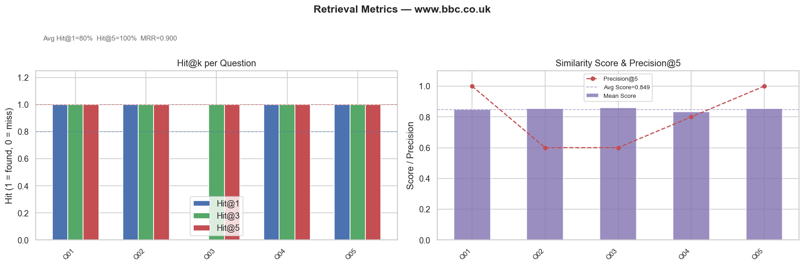
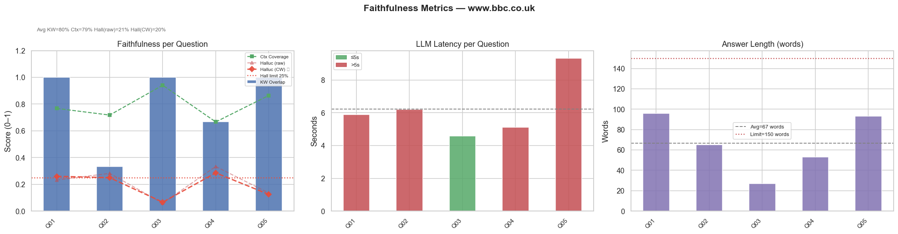
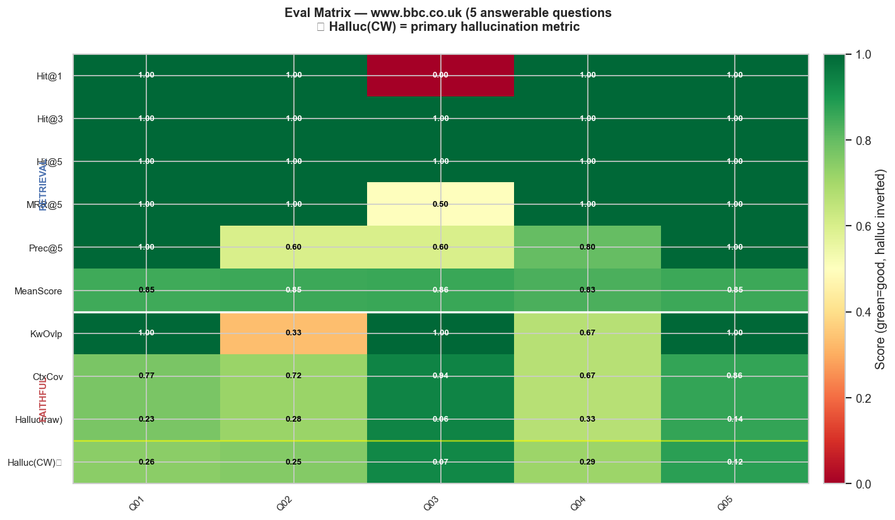
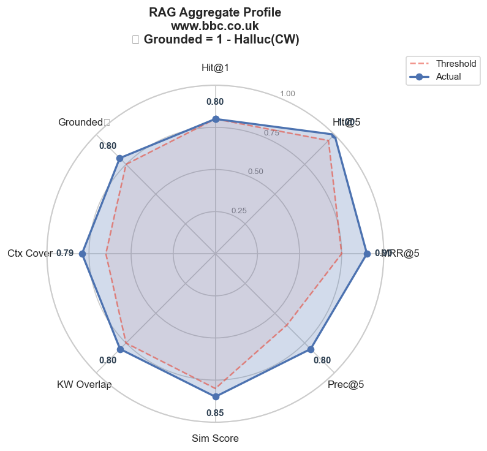
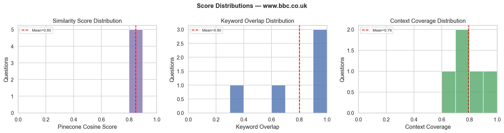

# Web Intelligence — AI Website Analyst

> Turn any public URL into a queryable knowledge base with source-backed answers, structured business insights, security analysis, and media extraction — powered by a production-grade RAG pipeline.


---

## Table of Contents

- [Features](#features)
- [Architecture](#architecture)
- [Tech Stack](#tech-stack)
- [Project Structure](#project-structure)
- [API Reference](#api-reference)
- [Configuration](#configuration)
- [Setup](#setup)
- [RAG Evaluation](#rag-evaluation)
- [Data & Sessions](#data--sessions)
- [Roadmap](#roadmap)

---

## Features

### Core Capabilities

| Feature | Description |
|---|---|
| **Multi-URL ingestion** | Accept 1–10 URLs per session; crawls up to 50 pages per domain |
| **Q&A chatbot** | RAG-powered answers with source chunk attribution and section links |
| **Business insights** | LLM-generated cards: introduction, features, business model, pricing, tech, audience, pros/cons |
| **Security analysis** | HTTPS, SSL, CSP, X-Frame-Options, XSS headers, cookie flag inspection |
| **Media extraction** | Collects up to 50 images per session with source page tracking |
| **Site comparison** | Side-by-side structured summary across multiple crawled URLs |
| **Session management** | Browser-token-scoped sessions; list, reload, delete individual or all |
| **Session forking** | When two browsers process the same URL, each gets an independent session |
| **Admin chat** | Landing-page assistant powered by a configurable knowledge base file |
| **Collaboration form** | Contact/collab submissions stored in Supabase PostgreSQL |
| **Thin-content repair** | LLM reformats pages with sparse scraped text before indexing |

### Q&A Chatbot Design

- Strict context-only answers — LLM cannot draw on training knowledge
- 150-word cap enforced in prompt (prevents verbose hallucination)
- Sources panel shows scored chunks with anchor links
- Example queries seeded on load

### Insights Generation

- 9 structured card sections generated from semantic multi-query retrieval
- Security card built from factual scraped headers (not LLM-generated)
- Intentionally allows synthesis beyond literal context (business intelligence mode)

---

## Architecture

```
┌─────────────────────────────────────────────────────────┐
│                     Browser (React)                      │
│  LandingView → [process URL] → Session                   │
│  ┌──────────┐ ┌───────────┐ ┌──────────┐ ┌──────────┐  │
│  │  Q&A     │ │ Insights  │ │  Sources │ │  Media   │  │
│  │ ChatPanel│ │InsightPanel│ │SourcePage│ │MediaPage │  │
│  └──────────┘ └───────────┘ └──────────┘ └──────────┘  │
└────────────────────────┬────────────────────────────────┘
                         │ HTTP (X-Browser-Token header)
┌────────────────────────▼────────────────────────────────┐
│                  FastAPI Backend                          │
│  /api/process  /api/ask  /api/insights  /api/compare    │
│  /api/session  /api/sessions  /api/chat  /api/collaborate│
└───────┬───────────────┬───────────────────┬─────────────┘
        │               │                   │
   ┌────▼────┐    ┌─────▼──────┐    ┌──────▼──────┐
   │ Scraper │    │  RAG Engine │    │  Supabase   │
   │BS4+reqs │    │  rag.py     │    │  PostgreSQL │
   └────┬────┘    └─────┬──────┘    └─────────────┘
        │               │
   ┌────▼────┐    ┌─────▼──────┐
   │Processor│    │  Embeddings │
   │ chunker │    │ MiniLM-L6  │
   └─────────┘    │  + FAISS   │
                  └────────────┘
```

**Request flow:**
1. Frontend sends URL(s) → `POST /api/process`
2. Scraper crawls pages, extracts structured sections and media
3. Processor chunks text with metadata; thin pages reformatted by LLM
4. MiniLM-L6-v2 encodes chunks; FAISS indexes vectors under `session_id`
5. Q&A: question encoded → top-k chunks retrieved → LLM answers strictly from context
6. Insights: 9 semantic queries retrieve diverse chunks → LLM generates structured cards

---

## Tech Stack

### Backend

| Layer | Library | Version | Role |
|---|---|---|---|
| API framework | FastAPI | 0.115 | REST endpoints, CORS, validation |
| ASGI server | Uvicorn | 0.30 | HTTP server |
| Scraping | requests + BeautifulSoup4 | latest | Page fetch, HTML parsing |
| Embeddings | sentence-transformers | latest | MiniLM-L6-v2 text encoder |
| Vector DB | FAISS + Pinecone SDK | ≥5.0 | Local vector index |
| LLM (local) | Ollama | ≥0.4 | Gemma3 or any Ollama model |
| LLM (cloud) | google-generativeai | ≥0.8 | Gemini 2.0 Flash |
| Database | psycopg2-binary | ≥2.9 | Supabase PostgreSQL (collab form) |
| Eval stopwords | NLTK | latest | 198-word English stopword corpus |
| Config | python-dotenv | 1.0 | `.env` loading |

### Frontend

| Layer | Library | Role |
|---|---|---|
| Framework | React 18 | Component tree |
| Build | Vite 5 | Dev server and bundler |
| Styling | TailwindCSS 3 | Utility-first CSS |
| Routing | React Router | Page navigation |
| HTTP | fetch / axios | API calls |

---

## Project Structure

```
web-intelligence/
│
├── backend/
│   ├── main.py              # FastAPI app, all route handlers
│   ├── scraper.py           # URL fetching, HTML parsing, media/security extraction
│   ├── processor.py         # Text chunking, source map builder
│   ├── embeddings.py        # EmbeddingStore: MiniLM encoding, FAISS index CRUD
│   ├── rag.py               # RAG answer_question(), build_insights(), prompt templates
│   ├── rag_eval_single.ipynb# Single-site RAG evaluation notebook (see §RAG Evaluation)
│   ├── requirements.txt
│   └── .env.example
│
├── frontend/
│   └── src/
│       ├── App.jsx              # Root component, routing
│       ├── main.jsx             # React entry point
│       ├── index.css            # Global styles
│       │
│       ├── pages/
│       │   ├── InsightsPage.jsx # Insights cards + security card
│       │   ├── SourcesPage.jsx  # Chunk browser with source attribution
│       │   └── MediaPage.jsx    # Image grid + colour theme display
│       │
│       └── components/
│           ├── LandingView.jsx       # URL input, session history, feature badges
│           ├── AppHeader.jsx         # Top nav, session title
│           ├── QAChatbot.jsx         # Full Q&A interface (tab)
│           ├── ChatPanel.jsx         # Chat message thread renderer
│           ├── InsightPanel.jsx      # Business insight card renderer
│           ├── ComparePanel.jsx      # Multi-URL comparison table
│           ├── SourcesPanel.jsx      # Inline sources list with scores
│           ├── UrlSidebar.jsx        # Session URL list with controls
│           ├── MediaPanel.jsx        # Image gallery component
│           ├── ChatWidget.jsx        # Admin chat bubble (landing)
│           ├── FeatureBadges.jsx     # Feature tag pills
│           ├── Loader.jsx            # Spinner component
│           ├── ErrorModal.jsx        # Fullscreen error overlay
│           ├── PrivacyModal.jsx      # Privacy policy modal
│           ├── CookiesModal.jsx      # Cookie notice modal
│           └── CollaborateModal.jsx  # Collaboration/contact form modal
│
├── data/
│   ├── faiss_index/         # FAISS index files (auto-created)
│   ├── sessions/            # Session JSON files (auto-created)
│   ├── cached_pages/        # HTML cache (auto-created)
│   ├── eval_retrieval_chart.png
│   ├── eval_faithfulness_chart.png
│   ├── eval_matrix_heatmap.png
│   ├── eval_radar_chart.png
│   ├── eval_distributions.png
│   └── eval_single_<site>_<date>.json
│
└── README.md
```

---

## API Reference

All endpoints except `/health` require the `X-Browser-Token` header (UUID v4 format).

### Health

| Method | Path | Description |
|---|---|---|
| `GET` | `/health` | Liveness check — returns `{status, timestamp}` |

### Session Management

| Method | Path | Description |
|---|---|---|
| `POST` | `/api/process` | Crawl URLs, build FAISS index, create session |
| `GET` | `/api/sessions` | List all sessions owned by this browser token |
| `GET` | `/api/session/{id}` | Fetch full session payload |
| `DELETE` | `/api/sessions/{id}` | Delete a single session and its vector index |
| `DELETE` | `/api/sessions` | Delete all sessions owned by this browser token |

**`POST /api/process` — request body:**
```json
{
  "urls": ["https://example.com"],
  "session_id": null
}
```

**Response:**
```json
{
  "session_id": "abc123",
  "title": "Example Domain",
  "urls": ["https://example.com"],
  "page_count": 12,
  "status": "processed | cached",
  "message": "Crawled 12 page(s), indexed 48 chunk(s).",
  "created_at": "2026-05-05T08:00:00Z",
  "theme": {}
}
```

### Content Endpoints

| Method | Path | Description |
|---|---|---|
| `POST` | `/api/ask` | RAG question → answer + sources |
| `GET` | `/api/insights/{id}` | Business insight cards + security card |
| `GET` | `/api/compare/{id}` | Per-URL summary rows for comparison |
| `GET` | `/api/session/{id}/sources` | All chunks grouped by URL |
| `GET` | `/api/session/{id}/media` | Images and colour theme |
| `GET` | `/api/example-queries` | Seed questions for chat UI |

**`POST /api/ask` — request body:**
```json
{
  "session_id": "abc123",
  "question": "What is this company's pricing model?",
  "top_k": 5
}
```

**Response:**
```json
{
  "answer": "**Pricing**\n- Free tier available...",
  "sources": [
    {
      "chunk_id": "...",
      "url": "https://example.com/pricing",
      "section_title": "Pricing Plans",
      "snippet": "...",
      "score": 0.871
    }
  ]
}
```

### Utility Endpoints

| Method | Path | Description |
|---|---|---|
| `POST` | `/api/chat` | Admin chat assistant (knowledge base from `admin-chat.md`) |
| `POST` | `/api/collaborate` | Submit collaboration/contact form to Supabase |

---

## Configuration

### Backend — `backend/.env`

```env
# LLM Provider: "ollama" (local) | "gemini" (cloud)
LLM_PROVIDER=gemini

# Ollama (when LLM_PROVIDER=ollama)
OLLAMA_URL=http://localhost:11434/api/generate
OLLAMA_MODEL=gemma3:latest

# Gemini (when LLM_PROVIDER=gemini)
GEMINI_API_KEY=your_key_here
GEMINI_MODEL=gemini-2.0-flash

# CORS — frontend origin
FRONTEND_ORIGIN=http://localhost:5173

# Supabase — for collaboration form storage
SUPABASE_CONNECTION_STRING=''
```

### Frontend — `frontend/.env`

```env
VITE_API_BASE_URL=http://localhost:8000
```

---

## Setup

### Prerequisites

- Python 3.11+
- Node.js 18+
- One of: Ollama running locally or cloud, or a Gemini API key
- (Optional) Supabase project for the collaboration form

### Backend

```bash
cd backend
python -m venv .venv
# Windows
.venv\Scripts\activate
# macOS / Linux
source .venv/bin/activate

pip install -r requirements.txt
cp .env.example .env
# Edit .env with your LLM provider credentials
```

### Frontend

```bash
cd frontend
npm install
cp .env.example .env
# Edit .env — set VITE_API_BASE_URL to your backend URL
```

---

## RAG Evaluation

The notebook [`backend/rag_eval_single.ipynb`](backend/rag_eval_single.ipynb) provides a full quantitative evaluation suite for the site Q&A chatbot pipeline.

> **Scope:** These metrics and thresholds apply **only** to the Q&A chatbot.
> Insights generation intentionally synthesises beyond literal context — it is exempt from these rules.

---

### Evaluation Design

Industry-standard split used by RAGAS, LlamaIndex Evaluators, and TruLens:

```
All eval questions
├── Answerable    → Hit@k · MRR · Precision · Faithfulness · Hallucination · Ctx Coverage
└── Unanswerable  → Rejection Rate  (did the system correctly refuse?)
```

**Why the split matters:** Including unanswerable questions in Hit@k or hallucination metrics is a category error. A system that correctly refuses an out-of-scope question should not penalise the answerable track — the two measure fundamentally different LLM behaviours.

---

### Metric Definitions

#### Retrieval Track (Answerable Only)

| Metric | Formula | Threshold |
|---|---|---|
| **Hit@k** | 1 if any of top-k chunks contains a keyword from the expected set | Hit@1 ≥ 80%, Hit@5 ≥ 95% |
| **MRR@5** | Mean Reciprocal Rank of first relevant chunk in top 5 | ≥ 0.75 |
| **Precision@5** | Fraction of top-5 chunks that are relevant | — |
| **Mean Score** | Average cosine similarity of top-k results | — |

Keyword matching uses `_norm_kw()` — strips hyphens, underscores, and whitespace before comparison so `"ecommerce"` matches `"e-commerce"` in chunk text.

#### Faithfulness Track (Answerable Only)

| Metric | Formula | Threshold |
|---|---|---|
| **KW Overlap** | Fraction of expected keywords present in the answer | ≥ 75% |
| **Ctx Coverage** | `\|answer_tokens ∩ context_tokens\| / \|answer_tokens\|` (NLTK stopwords removed) | ≥ 65% |
| **Hallucination (raw)** | `1 − Ctx Coverage` (all non-stopword tokens) | — |
| **Hallucination (CW) ★** | Non-context tokens among content words ≥5 chars only — primary metric | ≤ 25% |
| **Verbosity Score** | `max(0, (words − 150) / 150)` — 0 = within cap | — |
| **Avg Answer Words** | Mean word count across answerable questions | ≤ 150 |
| **Est. Context Tokens** | Total context chars / 4 (rough token estimate) | ≤ 3000 |

**Stopwords:** NLTK English corpus (198 words) with negations retained (`no`, `not`, `never`). This follows the technique used by LlamaIndex's `KeywordNodePostprocessor` and the RAGAS faithfulness scorer.

#### Rejection Track (Unanswerable Only)

| Metric | Formula | Threshold |
|---|---|---|
| **Rejection Rate** | Fraction of unanswerable questions where the system responded with the refusal phrase | ≥ 90% |

---

### Baseline Results — `www.aboutamazon.com`

Measured after prompt fix (context-only rule + 150-word cap). Top-k = 5, 5 answerable + 3 unanswerable questions.

#### Retrieval

| Q | Hit@1 | Hit@3 | Hit@5 | MRR@5 | Prec@5 | Score |
|---|---|---|---|---|---|---|
| A01 | 0 | 1 | 1 | 0.33 | 20% | 0.841 |
| A02 | 1 | 1 | 1 | 1.00 | 100% | 0.854 |
| A03 | 0 | 1 | 1 | 0.50 | 60% | 0.837 |
| A04 | 1 | 1 | 1 | 1.00 | 80% | 0.834 |
| A05 | 1 | 1 | 1 | 1.00 | 60% | 0.810 |
| **AVG** | **80%** | **100%** | **100%** | **0.883** | **72%** | **0.835** |

#### Faithfulness

| Q | KW Ovlp | Ctx Cov | Hall (raw) | Hall (CW) ★ | Words | Ctx Tok |
|---|---|---|---|---|---|---|
| A01 | 60% | 75% | 25% | 29% | 110 | 571 |
| A02 | 100% | 75% | 25% | 25% | 87 | 882 |
| A03 | 20% | 74% | 26% | 25% | 79 | 1063 |
| A04 | 50% | 72% | 28% | 35% | 110 | 869 |
| A05 | 80% | 73% | 27% | 29% | 99 | 917 |
| **AVG** | **53%** | **73%** | **27%** | **28%** | **97** | **860** |

#### Rejection (Unanswerable)

| Q | Question | Result |
|---|---|---|
| U01 | What is Amazon's net profit margin for the last quarter? | ✅ Refused |
| U02 | How many Amazon employees work in Germany specifically? | ✅ Refused |
| U03 | What programming language is Alexa backend written in? | ✅ Refused |
| **Rate** | | **100%** |

---

### Evaluation Charts

#### Retrieval Metrics — Hit@k and Similarity Score



Grouped bar chart: Hit@1 / Hit@3 / Hit@5 per question with mean similarity score and Precision@5 overlay.

---

#### Faithfulness Metrics — Hallucination, Context Coverage, Latency



Three panels:
1. **Faithfulness** — KW overlap bars, Ctx Coverage line, Hallucination (raw) and Hallucination (CW ★) series with threshold line at 25%
2. **LLM Latency** — per-question seconds, colour-coded red for >5s
3. **Answer Length** — word counts with 150-word threshold line

---

#### Eval Matrix Heatmap — All Metrics per Question



Green = good, Red = poor. Retrieval metrics in upper block, faithfulness in lower. `Halluc (CW) ★` is the primary hallucination row. Values annotated in each cell.

---

#### Aggregate Radar Profile



Filled polygon of 8 aggregate metrics vs red dashed threshold polygon. Gap between polygon edges shows distance from target for each axis.

---

#### Score Distributions



Histograms of similarity score, keyword overlap, and context coverage across all questions — shows distribution shape, not just averages.

---

### Issues Found and Fixes Applied

| # | Issue | Observed Score | Root Cause | Fix Applied |
|---|---|---|---|---|
| 1 | **Hit@1 = 60%** | Q01, Q03 miss | `chunk_hit` exact string match: `"ecommerce"` ≠ `"e-commerce"` in chunk text | `_norm_kw()` strips hyphens/spaces before comparison → Hit@1 improved to **80%** |
| 2 | **Hallucination ≈ 41%** | All 5 Q above threshold | Prompt said `"Prioritise"` context + `"Under 400 words"` → LLM filled gaps from training knowledge | Prompt changed to `"ONLY use information in CONTEXT"` + 150-word hard cap → **hall (CW) ≈ 28%** |
| 3 | **Words 214–331** | Q03=331, Q05=230 | No effective word cap; LLM elaborated freely | Prompt cap: 150 words (200 absolute max) → **avg 97 words** |
| 4 | **Context tokens unmeasured** | Up to ~3400 est. | Production uses `top_k=12` but eval used `top_k=5` — gap never reported | `ctx_tokens` field added per question; threshold set at ≤3000 |
| 5 | **Stopwords too narrow** | 60 words | Manual list → connector words inflated apparent hallucination | NLTK English corpus: **198 words** (technique from LlamaIndex eval) |
| 6 | **Unknown Q contaminated metrics** | n/a | Unanswerable questions dragged Hit@k average down | Separate **answerable / unanswerable** tracks; unanswerable measured by **rejection rate** |

---

### Notebook Sections

| Section | Description |
|---|---|
| **0. Rules & Thresholds** | Quantitative targets, root-cause table, scope note |
| **1. Configure Target** | `TARGET_URL` and `TOP_K` — auto-resolves session |
| **2. Eval Questions** | QA bank with `answerable` flag; answerable/unanswerable split |
| **3. Retrieval Eval** | Hit@k, MRR, Precision, Similarity — answerable questions only |
| **3.5. Hit@1 Diagnosis** | Per-failure: shows top chunk content vs expected keywords, scores gap |
| **4. Faithfulness Eval** | Answerable: faithfulness metrics; Unanswerable: abstention check |
| **4.5. Hallucination Breakdown** | Per-question word classification: LLM knowledge leakage vs connector expansion |
| **4.6. Verbosity Analysis** | Simulates hallucination score at 150-word cap to isolate verbosity inflation |
| **5–9. Charts** | Retrieval, Faithfulness, Heatmap, Radar, Distributions |
| **10. Metric Tables** | Printed retrieval and faithfulness tables with flag annotations |
| **10.5. Pass/Fail Dashboard** | Both tracks: answerable (8 checks) + unanswerable (rejection rate) |
| **11. Baseline Summary Box** | ASCII summary with PASS/FAIL per metric and scope reminder |
| **12. Inspect Individual** | Per-question deep-dive: chunk content, answer, all scores |
| **13. Save Results** | Writes JSON with both tracks + stopword source metadata |

---

## Data & Sessions

| Path | Contents | Auto-created |
|---|---|---|
| `data/faiss_index/` | FAISS vector index files per session | Yes |
| `data/sessions/` | Session JSON (URLs, pages, chunks, theme, images) | Yes |
| `data/cached_pages/` | Raw HTML cache to avoid re-fetching | Yes |
| `data/eval_single_<site>_<date>.json` | Eval run output — retrieval + faithfulness + rejection summaries | On eval run |
| `data/eval_*.png` | Evaluation chart images | On eval run |

### Session JSON Schema

```json
{
  "session_id": "abc123",
  "browser_token": "uuid-v4",
  "vector_namespace": "abc123",
  "title": "Example Site",
  "urls": ["https://example.com"],
  "page_count": 12,
  "created_at": "2026-05-05T08:00:00Z",
  "pages": [{ "url": "...", "title": "...", "sections": [], "images": [], "security": {} }],
  "chunks": [{ "chunk_id": "...", "url": "...", "text": "...", "section_title": "..." }],
  "theme": { "primary": "#000", "background": "#fff" },
  "images": [{ "url": "...", "page_url": "..." }]
}
```

---

## Roadmap

- [ ] Streaming responses (SSE or WebSocket)
- [ ] Re-ranking layer (cross-encoder) to improve Hit@1
- [ ] LLM-as-judge faithfulness scoring (RAGAS-compatible)
- [ ] NDCG@k metric added to retrieval eval
- [ ] JavaScript-rendered page support (Playwright integration)
- [ ] User authentication and persistent cloud sessions
- [ ] Background job queue for large crawls
- [ ] Deployment scripts: Render/Railway (backend) + Vercel/Netlify (frontend)
- [ ] Eval notebook support for multi-site batch runs
